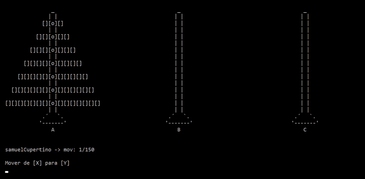

# torre-de-hanoi
Torre de Hanói desenvolvida em Linguagem C, com gráficos de matriz de caracteres. Obs: O programa se encontra com seu código original, não foi realizado refatoração. Sendo seu código-fonte datado de 10/09/2019, período onde estava aprendendo programação com C, no segundo semestre da faculdade. 

Adicionar números impares no inicio da lista e para no final:

